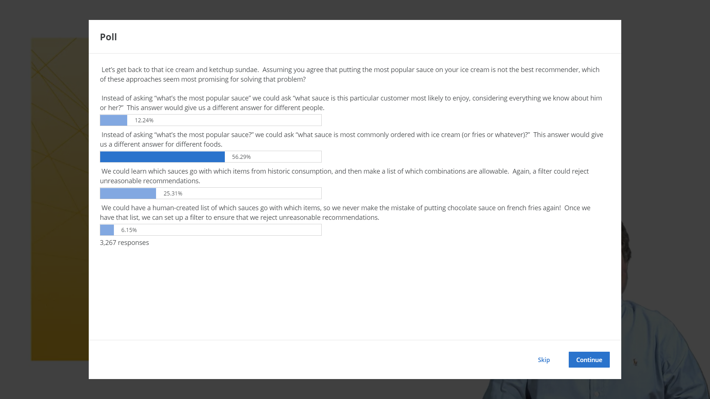

# Summary Statistics

> First technique for non-personalized recommendation

## Computing the scores

* What should they mean
  * Popularity (will be challenging)
  * Average rating
  * Probability of you liking
* How to compute
  * Frequency
  * Average
  * More complicated

## Same idea, different formula

* How do we treat score or "good" vs. "awful"

> Now you think about this.  When are you most interested in how often something is good, and when are you interested in how good it is, on average?  Would you rather go on a cruise where 98% of people are pretty happy, or where only 90% are happy, but those 90% are extremely happy?  
>
> This isn’t a new problem -- this problem relates to the economic concept of utility.  It is the same question that may lead some people to decide it is worth buying a lottery ticket every day ($1 a day’s worth of happiness isn’t worth as much as a remote chance of becoming crazy-millionaire happy!) and why others think it is a waste of money.
>
> What do you think?  Do you prefer to gamble for the big win?  Take the safe-but-smaller win?  

* Popularity is an Import Metric
* Average Can be Misleading
  * Can adjust by summing % who like
  * Can adjust by normalizing user ratings
    * normalization addresses different rating scales
  * May want to consider credibility of individual raters (history of ratings)
* More data is better ... to a point
  * Average, Count, Distribution

Missing stuff in non-personalization recommendation

* Who you are
* Your context

## Bias

> * Too many mediocre restaurants with good scores => 22 -> 25
> * Too many excellent restaurants with mediocre scores => 28 -> 26

* Self-selection bias
  * People rate the restaurant they go to
  * You won't go to a store you don't like and give it a negative score
* Increased diversity of raters
  * People have different tastes
  * Average wash together

## Take-away

* Non-personalization popularity statistics or average can be effective in the right application
  * Need to understand relationship between average and user need; correct average
* In many cases it can be best to show count, average, and distribution together
* For ranking, one alternative to average is the percentage who score above a threshold (or below)
* Personalization would address many limitations

> 
>
> Now that you’ve seen what others said, here’s our thinking …
>
> We wouldn’t personalize to the customer here, because just because I enjoy mustard doesn’t mean I want it on ice cream.  I’d probably choose to go with “most common with a particular food,” but either of the filter lists could be used as a way to mix a “let’s not embarrass ourselves” into another form of recommender.  As to whether to do it automatically or manually, that depends on what type of embarrassment you’re worried about.  An automatic list is easier, but it might invite occasional attacks (from the ketchup sundae brigade) and might not recognize cultural faux pas (such as avoiding meat sauce on ice cream for customers who keep Kosher).
